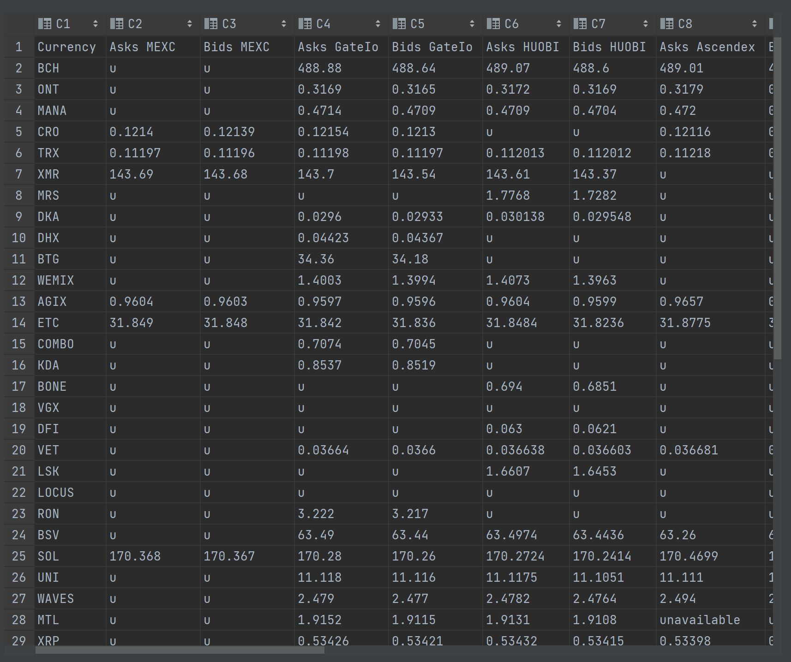

# Crypto-parser by Lizaza

## Работа с программой:  

- main.py
- Просмотр папки results
- Поиск последнего созданного файла
- Просмотр его
- Успех!!!!!!!!!!!!!!!!!

## Краткое объяснение программы

- Определяется список нужных нам валют
- Для каждой валюты создается поток, который будет смотреть на всех определенных в программе биржах данную валюту.
- После обращения к каждой бирже через api парсится информация, где определены ```asks``` и ```bids```. Пример:  
```text
{'success': True, 'code': 0, 'data': {'ct': 1716874566149, 'symbol': 'BTC_USDT', 'askMarketLevelPrice': 67790.8, 
'asks': [[67788.9, 79853, 1], [67789, 79830, 1], [67789.1, 95545, 2], [67789.2, 91190, 2], [67789.3, 75714, 1], 
[67789.4, 74335, 1], [67789.5, 74788, 1], [67789.6, 72654, 1], [67789.7, 83842, 1], [67789.8, 69974, 1], 
[67789.9, 72324, 1], [67790, 64767, 1], [67790.1, 70897, 1], [67790.2, 78962, 1], [67790.3, 69206, 1], 
[67790.4, 77197, 1], [67790.5, 72067, 1], [67790.6, 82173, 1], [67790.7, 68453, 1], [67790.8, 68600, 1], 
[67790.9, 67743, 1], [67791, 66275, 1], [67791.1, 76184, 1], [67791.2, 76586, 1], [67791.3, 64660, 1]], 
'bids': [[67788.8, 73598, 1], [67788.7, 97440, 2], [67788.6, 104323, 2], [67788.5, 80298, 1], [67788.4, 73814, 1], 
[67788.3, 83961, 1], [67788.2, 69507, 1], [67788.1, 75756, 1], [67788, 67090, 1], [67787.9, 79472, 1], 
[67787.8, 80866, 1], [67787.7, 63879, 1], [67787.6, 75974, 1], [67787.5, 65828, 1], [67787.4, 73798, 1], 
[67787.3, 69333, 1], [67787.2, 76482, 1], [67787.1, 68423, 1], [67787, 67984, 1], [67786.9, 72800, 1], 
[67786.8, 84008, 1], [67786.7, 83287, 1], [67786.6, 76993, 1], [67786.5, 70548, 1], [67786.4, 68781, 1]], 
'version': 16705439920, 'bidMarketLevelPrice': 67786.9, 'timestamp': 1716874566236}}
```
- Сохранение в файл

## Пример данных в файле

